# Seyaha

This is an Android Application that  provides the tourists who have never been in Jordan before or have a vague knowledge about what to do in Jordan, where to go and how to get the most out of their time in this beautiful country. this app offers a collection of tours both ranked by top rated (peoples favorites) or the user's interests , each tour includes a collection of iconic tourist attraction places.
   
Our plan is to help the tourists to navigate through Jordan without needing the help of a guide or a tourist office that might over charge them or scam them in some way or another.

## User Manual
    
The process of using our app is pretty simple, first you log in by either (Facebook or Google account):

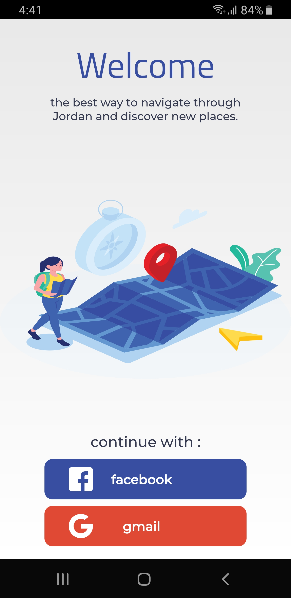
     

Then a list of top rated tours pops up that you can check out, review and give your feedback on:  

      
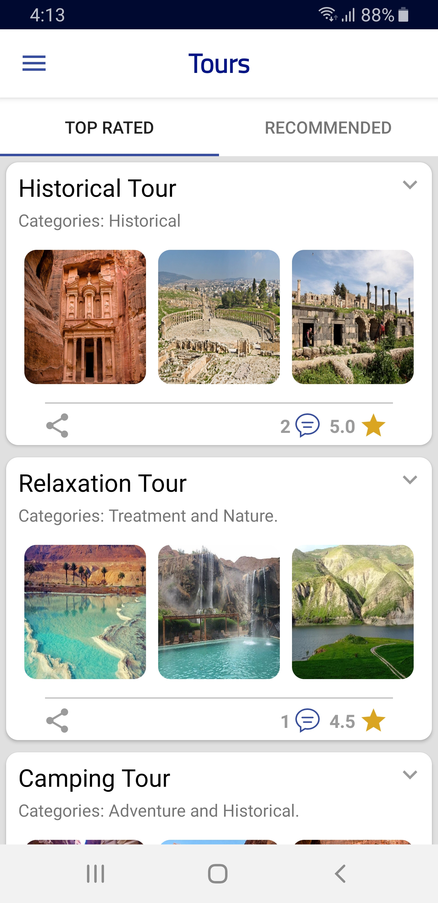  
     

The user can go to his/her profile fragment to choose some of his/her hobby that they could enjoy and get customized tours matching their interests: 
    

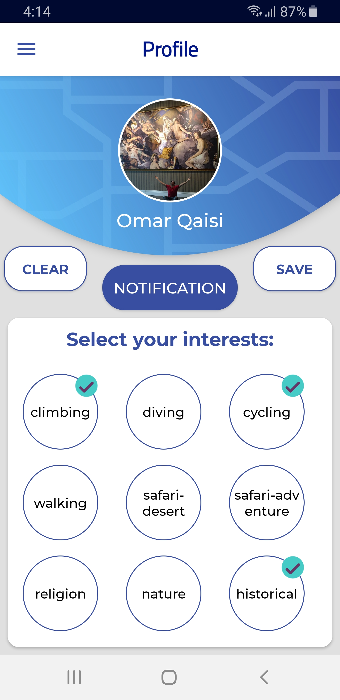 &nbsp; &nbsp; &nbsp;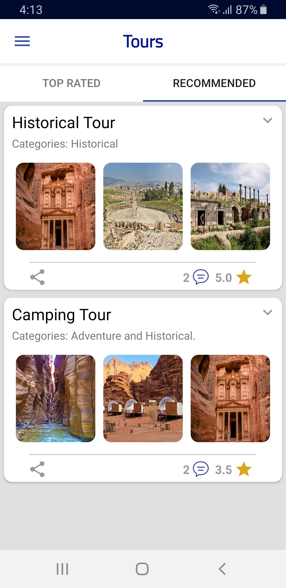 
    

The user can change the app's language by choosing one of either Arabic or English in the language section in the navigation drawer: 
       
       
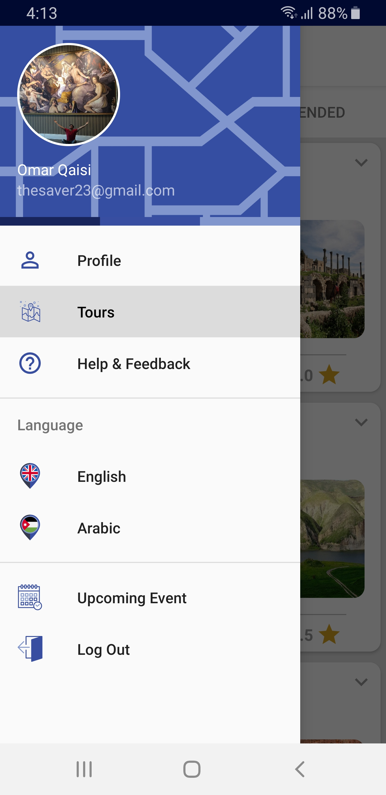 &nbsp; &nbsp; &nbsp;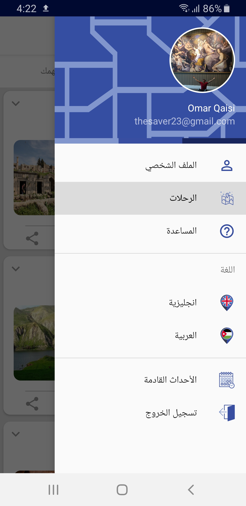
    
    
   
The user can get a quick glance at how his tour pathway will take him by over viewing all the places in one map by clicking on the drop down arrow on the top right of each tour and select (Tour OverView):
    
    
 &nbsp; &nbsp; &nbsp;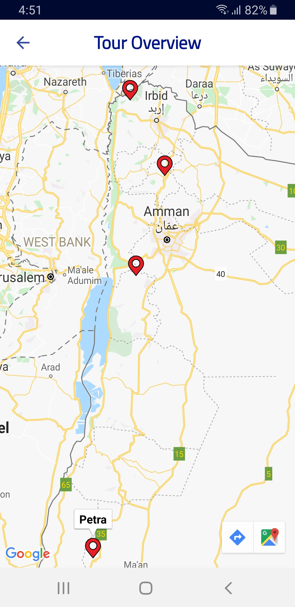
    
    
    
When you click on any tour you will have a list of places, each place in the tour has a description that provides a quick summary of what the sentiment of the place is and some historical facts and a heap of helpful information (avg expenses, temperature(live-data),air & internet quality for each place, and the nearby Hotels and Restaurants), you get the location of each place pinpointed on a map that can provide the direction to that desired place:

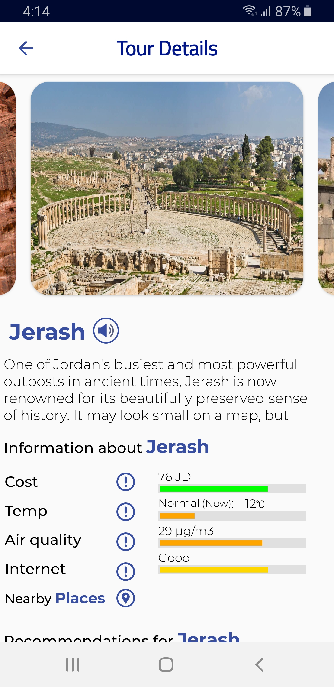 &nbsp; &nbsp; &nbsp;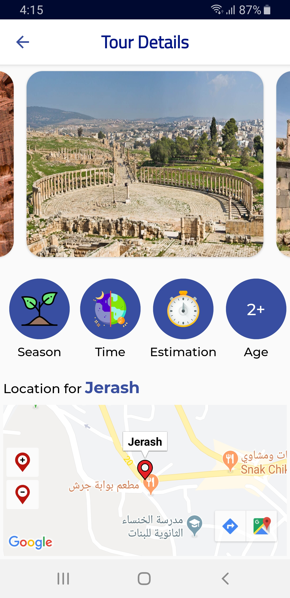 &nbsp; &nbsp; &nbsp;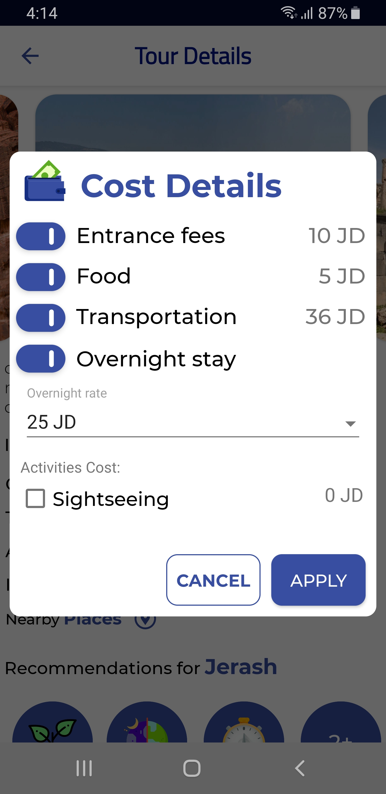 &nbsp; &nbsp; &nbsp;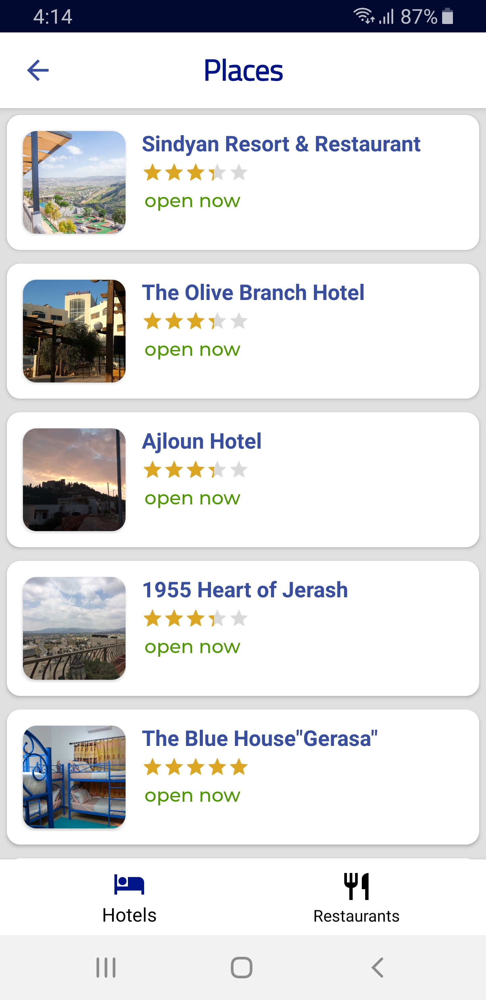

       
       
As an ADMIN you can add a tour by clicking the floating button on the bottom right corner of the (Tours Fragment). it requires you to select at least 3 places and a name in both Arabic and English to successfully publish a new tour for the user to check out:
    
     
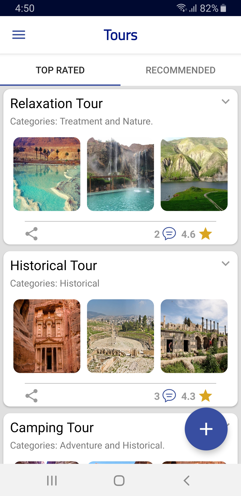 &nbsp; &nbsp; &nbsp;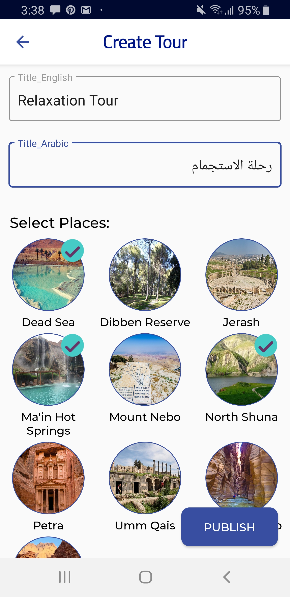
         
           
              
As an ADMIN you can delete a tour by clicking on the drop down arrow on the top right of each tour and select (Delete Tour):
  
    
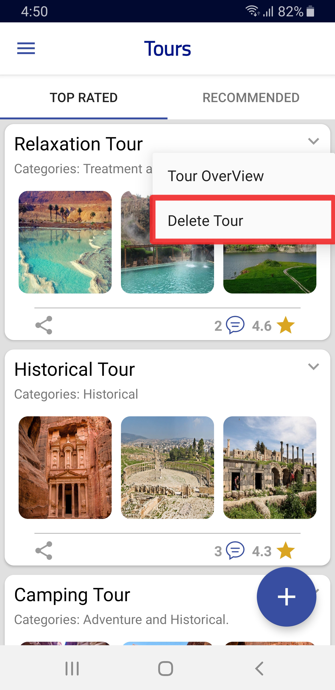

   
## Built With

* [Android Studio](https://developer.android.com/studio/?gclid=Cj0KCQiAtrnuBRDXARIsABiN-7BH-n_44qHpgiYIn0QeA20VMrD_rHJTwTyq1ZagoQOyrBsp9Wd4Aa0aAiliEALw_wcB) - Android Studio is the official integrated development environment (IDE) for Android application development.

* [Firebase](https://firebase.google.com/) - Firebase is a Backend-as-a-Service — BaaS — that provides an app-development platform on Google Cloud Platform.

## Built By

* **Lena Al-bayed** - [lenaomar](https://github.com/lenaomar)
* **Heba Al-hindi** - [heba-al-hindi](https://github.com/heba-al-hindi)
* **Motasem Naqawah** - [moenaqawah](https://github.com/moenaqawah)
* **Anass Rasheed** - [anassrasheed](https://github.com/anassrasheed)
* **Omar Al-qaisi** - [OmarQaisi](https://github.com/OmarQaisi)

## License

This project is licensed under the MIT License - see the [LICENSE](LICENSE) file for details
